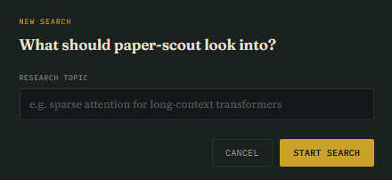
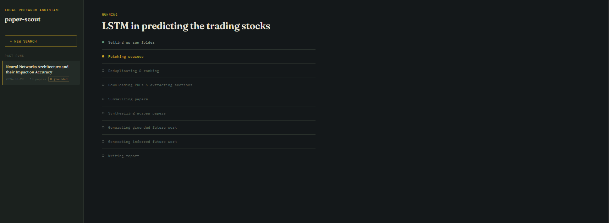
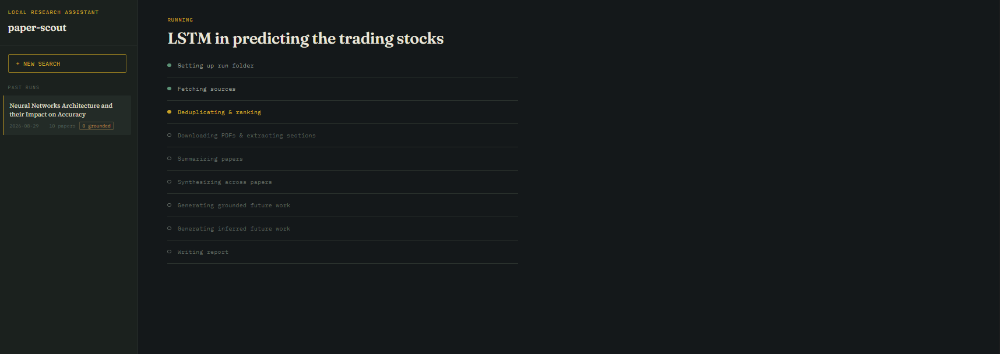
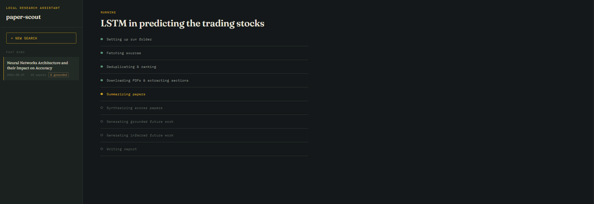
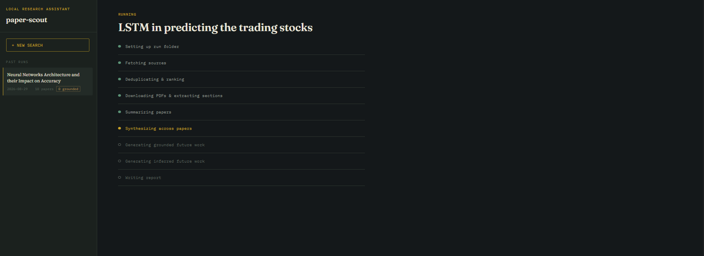
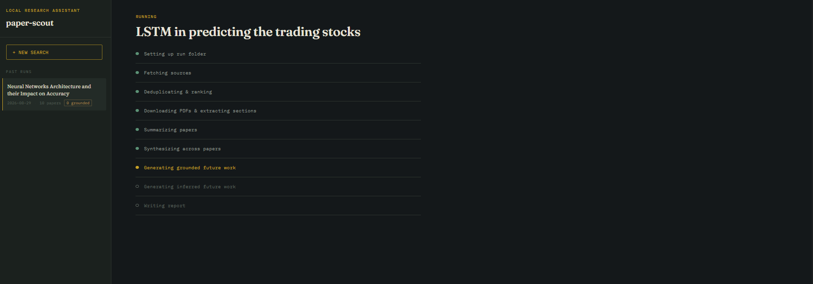
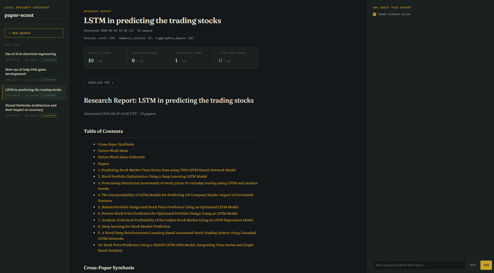
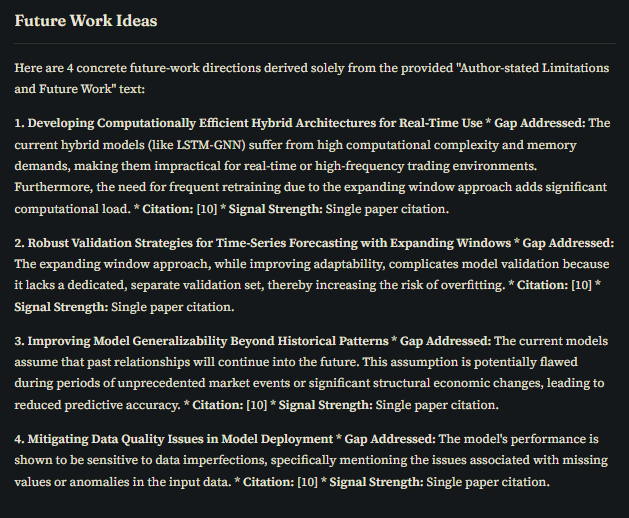
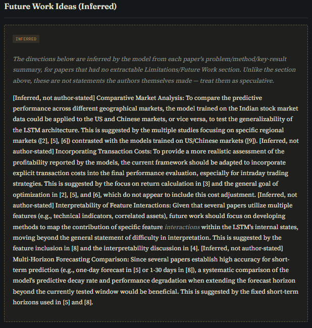

# paper-scout

</br>
</br>
<div align="center">
    
</div>
</br>
</br>

paper-scout is an agentic pipeline that takes a research topic as input, searches multiple paper sources, and produces a report summarizing recent work in that area. The standout feature is future work ideation that is grounded in the actual Limitations and Future Work sections extracted from the papers themselves, rather than free form brainstorming from a language model. Where a paper doesn't have those sections, the pipeline still offers a second, clearly labeled tier of inferred directions instead of silently skipping the paper.

The whole thing runs locally through Ollama, using a small model for per paper summarization and a larger model for cross paper synthesis and ideation. It can be used from the command line or through a local web interface.

## 🔍 What it does

Give it a query like `"diffusion models for audio"` and it will:

1. Search arXiv, Semantic Scholar, and Hugging Face Papers
2. Deduplicate results across sources and rank them by relevance, recency, and citation count
3. Download PDFs and extract each paper's Abstract, Conclusion, Limitations, and Future Work sections, using a column aware extractor that correctly handles two column academic layouts
4. Summarize each paper with a small local model
5. Synthesize themes and contradictions across the whole set with a larger local model
6. Generate future work directions in two tiers:
   - **Grounded** directions, traceable to what the papers themselves state in their Limitations/Future Work sections
   - **Inferred** directions, for papers with no extractable Limitations/Future Work section, reasoned from the paper's problem, method, and key result instead. These are always explicitly tagged `[Inferred, not author-stated]` so they are never mistaken for grounded ones
7. Write everything to a self contained per run output folder: a markdown report, a PDF version of the same report, the metadata of the run, and the downloaded PDFs for every paper in the run

You run one command or one click and get one folder. No intermediate prompts, no manual steps in between.

## 🧠 Key concepts

- **Grounded ideation.** Future work directions in the main report section are only ever generated from text the paper's own authors wrote. If no paper in a run has any extractable Limitations or Future Work text, that section is refused entirely rather than filled with generic LLM brainstorming.
- **Inferred ideation (second tier).** Papers with no extractable Limitations/Future Work section still get a chance at future work ideation, but only from their problem, method, and key result summary, and only in a separate report section that is explicitly labeled as inferred, never author stated. This keeps the trustworthy tier trustworthy while still surfacing something useful for papers that would otherwise get nothing.
- **Column aware extraction.** Two column academic PDFs are read using PyMuPDF's block level layout data rather than plain top to bottom text extraction, so column text isn't interleaved and heading lines survive intact.
- **Graceful degradation.** Every source, every paper, and every pipeline stage is built to fail without taking the rest of the run down with it. A blocked source, a failed download, or a missing section all fall back to a sensible default instead of raising.
- **Self contained run folders.** Each run gets its own folder under `outputs/` containing the report and every PDF used to produce it, with no shared cross run cache.

## ⚙️ Requirements

- Python 3.12
- [Ollama](https://ollama.com) installed and running locally
- Two pulled models: a small one for summarization and a larger one for synthesis (configurable, see below)
- Roughly 32GB RAM recommended for comfortable CPU offload of the larger model
- [GTK3 runtime](https://github.com/tschoonj/GTK-for-Windows-Runtime-Environment-Installer/releases) (Windows only) for PDF report generation via WeasyPrint. Not needed on macOS/Linux, where the required libraries are typically already present or installable via the system package manager.

## 🛠️ Setup

```bash
git clone https://github.com/AmirmasoudCS/paper-scout.git
cd paper-scout
python -m venv .venv
.venv\Scripts\activate   # or source .venv/bin/activate on Mac/Linux
pip install -e .
pip install -r requirements.txt
```

Pull the models referenced in `config.yaml`:

```bash
ollama pull qwen3.5:9b
ollama pull gemma4:e4b
```

## 🚀 Usage

### Command line

```bash
python -m paper_scout "your research topic here"
```

### Web interface

```bash
uvicorn paper_scout.web.app:app --reload
```

Then open `http://127.0.0.1:8000` in your browser. Click **New search**, enter a topic, and watch the run progress stage by stage in real time. Past runs are listed in the sidebar and can be reopened at any point.

<p align="center">
  
</p>

<p align="center">
  
</p>

Each pipeline stage is shown as it completes:

<p align="center">
  
  
  
  
</p>

Once a run finishes, the report is rendered directly in the browser, including the two future work tiers side by side:

<p align="center">
  
</p>

<p align="center">
  
  
</p>

Both the command line and the web interface run the exact same pipeline and write to the same `outputs/` folder, so a run started from one can be opened from the other.

Each run creates its own folder under `outputs/`, named after your query and the date, containing:

```
📁 outputs
└── 📁 neural-networks-architecture-and-their-impact-on-accuracy_2026-08-29
    ├── 📁 pdfs
    │   ├── 📕 1511.05497v2.pdf
    │   ├── 📕 1905.05918v1.pdf
    │   ├── 📕 2006.07556.pdf
    │   ├── 📕 2009.00804v2.pdf
    │   ├── 📕 2109.12426.pdf
    │   ├── 📕 2307.05639v2.pdf
    │   └── 📕 2510.21866.pdf
    ├── 📘 report.md
    ├── 📕 report.pdf
    └── 🧩 run_metadata.json
```
> Generated using [Tree Printer](https://github.com/AmirmasoudCS/Tree-Printer.git)

There is no shared cross run PDF cache. Every run's PDFs live inside that run's own folder, so a run directory is fully self contained and portable. You can zip it, move it, or delete it without affecting any other run.

## 🔧 Configuration

All tunable settings live in `config.yaml`: which sources are enabled, how many papers to pull, ranking weights, which Ollama models to use, and report formatting. Nothing is hardcoded, so you can adjust behavior without touching the code.

## 📁 Project structure

```
📁
├── 📁 assets
│   └── 📁 screenshots
├── 📁 log
├── 📁 outputs
│   ├── 📁 lstm-in-predicting-the-trading-stocks_2026-08-29
│   │   ├── 📁 pdfs
│   │   ├── 📘 report.md
│   │   └── 🧩 run_metadata.json
│   └── 📁 neural-networks-architecture-and-their-impact-on-accuracy_2026-08-29
│       ├── 📁 pdfs
│       ├── 📘 report.md
│       └── 🧩 run_metadata.json
├── 📁 paper_scout
│   ├── 📁 ingestion
│   │   ├── 🐍 __init__.py
│   │   ├── 🐍 ingest.py
│   │   ├── 🐍 pdf_fetch.py
│   │   └── 🐍 section_extract.py
│   ├── 📁 llm
│   │   ├── 🐍 __init__.py
│   │   ├── 🐍 ollama_client.py
│   │   └── 🐍 prompts.py
│   ├── 📁 ranking
│   │   ├── 🐍 __init__.py
│   │   ├── 🐍 dedupe.py
│   │   └── 🐍 rank.py
│   ├── 📁 report
│   │   ├── 🐍 __init__.py
│   │   └── 🐍 report_writer.py
│   ├── 📁 sources
│   │   ├── 🐍 __init__.py
│   │   ├── 🐍 arxiv_source.py
│   │   ├── 🐍 base.py
│   │   ├── 🐍 huggingface_papers_source.py
│   │   ├── 🐍 runner.py
│   │   └── 🐍 semantic_scholar_source.py
│   ├── 📁 summarize
│   │   ├── 🐍 __init__.py
│   │   └── 🐍 summarizer.py
│   ├── 📁 synthesize
│   │   ├── 🐍 __init__.py
│   │   ├── 🐍 cross_paper.py
│   │   └── 🐍 future_work.py
│   ├── 📁 utils
│   │   ├── 🐍 __init__.py
│   │   ├── 🐍 config.py
│   │   ├── 🐍 logging_config.py
│   │   └── 🐍 models.py
│   ├── 📁 web
│   │   ├── 📁 static
│   │   │   └── 🎨 style.css
│   │   ├── 📁 templates
│   │   │   ├── 📁 partials
│   │   │   │   ├── 🌐 job_error.html
│   │   │   │   ├── 🌐 progress.html
│   │   │   │   ├── 🌐 report.html
│   │   │   │   └── 🌐 run_list.html
│   │   │   ├── 🌐 base.html
│   │   │   ├── 🌐 index.html
│   │   │   └── 🌐 new_run_modal.html
│   │   ├── 🐍 __init__.py
│   │   ├── 🐍 app.py
│   │   ├── 🐍 jobs.py
│   │   └── 🐍 runs.py
│   ├── 🐍 __init__.py
│   ├── 🐍 __main__.py
│   ├── 🐍 cli.py
│   └── 🐍 pipeline.py
├── 📁 scripts
│   ├── 🐍 compare_extraction_methods.py
│   ├── 🐍 diagnose_headings.py
│   ├── 🐍 recheck_extraction.py
│   └── 🐍 smoke_test.py
├── 📁 tests
│   ├── 🐍 conftest.py
│   ├── 🐍 test_ingestion.py
│   ├── 🐍 test_llm.py
│   ├── 🐍 test_pipeline.py
│   ├── 🐍 test_ranking.py
│   ├── 🐍 test_report.py
│   ├── 🐍 test_sources.py
│   ├── 🐍 test_summarize.py
│   └── 🐍 test_synthesize.py
├── 📄 banner_hand_drawn.svg
├── 📄 config.yaml
├── ⚖️ LICENSE
├── ⚙️ pyproject.toml
├── 📄 pytest.ini
├── 📘 README.md
└── 📝 requirements.txt
```
> Generated using [Tree Printer](https://github.com/AmirmasoudCS/Tree-Printer.git)

Every module is independently tested. Run the full test suite with:

```bash
pytest tests/ -m "not ollama and not network"
```

Tests marked `ollama` or `network` require a running local Ollama server or live internet access respectively, and are excluded by default so the core suite runs anywhere.

## 📝 Notes

- Every source fetcher and pipeline stage is designed to fail gracefully. One source or paper failing does not stop the whole run.
- Section extraction is column aware. It correctly handles two column academic PDF layouts instead of interleaving text from adjacent columns, and heading detection distinguishes real section headings from ordinary body text that happens to wrap onto its own line.
- Future work ideation is two tiered. The grounded tier will refuse to run rather than fall back to ungrounded brainstorming if none of the papers have extractable Limitations or Future Work text. The inferred tier picks up the papers the grounded tier cannot use, reasoning only from each paper's problem, method, and key result summary, and is always rendered in its own clearly labeled report section, never blended with the grounded output.
- The web interface shows live, stage by stage progress for a running query and lets you browse every past run from the same place. Both the CLI and the web interface call the same pipeline underneath.
- Query history search and comparing runs against each other are planned as future additions but are not part of the current scope.

## ⚖️ License

[MIT](./LICENSE)